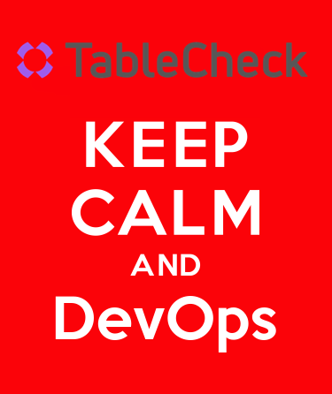

 

# TableCheck DevOps Framework - based on the adidas DevOps maturity framework

The DevOps maturity framework was created by adidas as a guide for the first DevOps cup to support
the teams on their DevOps transformation journey.

Based in the C.A.L.M.S. definition of DevOps, the framework defines a set of capabilities and 
guidelines that when adopted, increases efficiency (speed, cost...), effectiveness (quality...)
and happiness of the team.

* <b>C</b>ulture
* <b>A</b>utomation
* <b>L</b>ean
* <b>M</b>easurement
* <b>S</b>haring

### Motivation

The framework defines maturity levels for each capability that teams can use to self-assess their 
current maturity and understand what needs to be done to go to the next level. 

As practitioners Lean practitioners our framework is in continuous evolution and the "Run" of today 
might be the "Walk" of tomorrow, helping the teams to aim for continuous improvement.

### Contents

* [DevOps Maturity Framework](framework/devops_maturity_framework.md)
* [DevOps Maturity Increase Index (DMII)](framework/dmii.md)

### Changes

* Replaced some wording to better suit a remote-first culture.
* Fixed some grammatical errors.

## License and Software Information

Licenced under MIT. See the original at https://github.com/adidas/adidas-devops-maturity-framework and the [LICENSE](LICENSE) for further information.

### License

[MIT](LICENSE)
